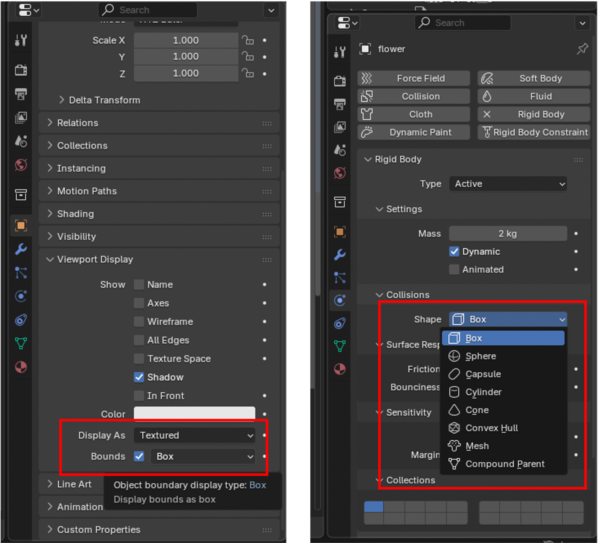

# Blender Notes
## bullet engine for rendering rigid collision

### step1: preprocess
Load an object asset and remove redundant points to simplify the geometry.
```python
# merge neighboring points
import bpy
import bmesh

obj = bpy.context.active_object
if obj and obj.type == 'MESH':
    # 创建bmesh对象
    bm = bmesh.new()
    bm.from_mesh(obj.data)
    # 合并重复顶点
    bmesh.ops.remove_doubles(bm, verts=bm.verts, dist=0.0001)
    # 将修改写回网格
    bm.to_mesh(obj.data)
    bm.free()
    # 更新网格
    obj.data.update()
```

```python
# delete unnecessary parents
import bpy

# 方法1: 删除所有对象的父子关系
for obj in bpy.data.objects:
    obj.parent = None

# 方法2: 删除选中对象的父子关系
for obj in bpy.context.selected_objects:
    obj.parent = None

# 方法3: 删除父子关系并保持变换(推荐)
for obj in bpy.data.objects:
    if obj.parent:
        # 保存世界坐标变换
        matrix_world = obj.matrix_world.copy()
        # 清除父级
        obj.parent = None
        # 恢复世界坐标位置
        obj.matrix_world = matrix_world
```

### Step2: add rigid body world and set up attributes for each object
**Passive object**: participates in collisions but never moves;
**Active object**: fully simulated by physics and can move, rotate, or react to forces and impacts.

To avoid incorrect mesh calculation, we should set the origin of an object identical to the center of the bounding box that actually used for collision calculation. Two bounding box should align exactly. All box should be placed above the passive ground.


For each object, ``✅Dynamic`` in UI or ``car.rigid_body.kinematic=False`` in script means the object is controlled by physics simulation; ``✅Animated`` in UI or ``car.rigid_body.kinematic=True`` in script means the object is controlled by keyframes.

``Convex Hull + Final`` is the most stable combination for collision calculation in my experience. ``collision margin`` has to be set to a small number (e.g. 0.001 cm). Objects within the same ``Collections`` interact with each other. ``Deactivation`` means the object stay static until interactions happen.

### Step3: add velocity to moving object

There is no explicity linear velocity in Blender 4.5.3. The velocity has to be set by a short clip of animation (key frames). The code is in [set_initial_velocity.py](set_initial_velocity.py).